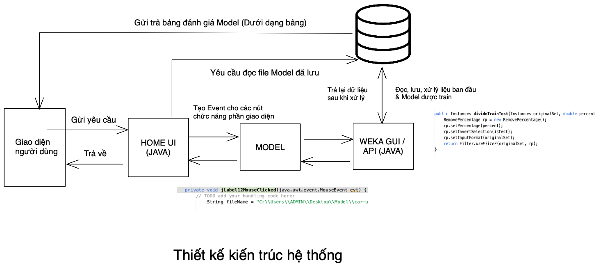
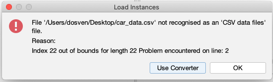
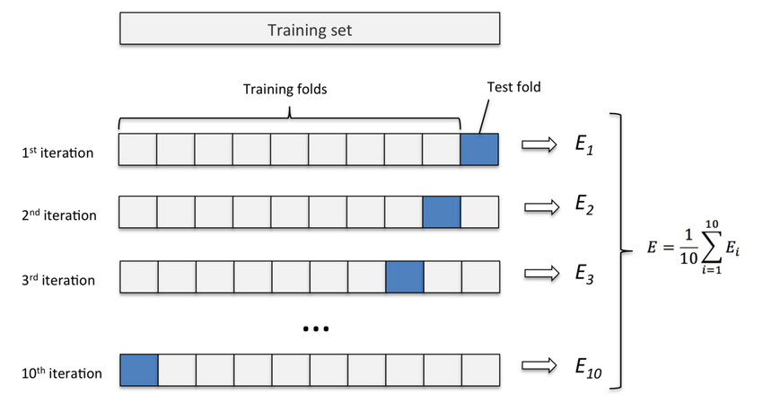
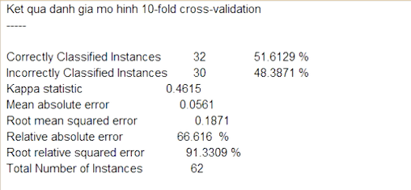
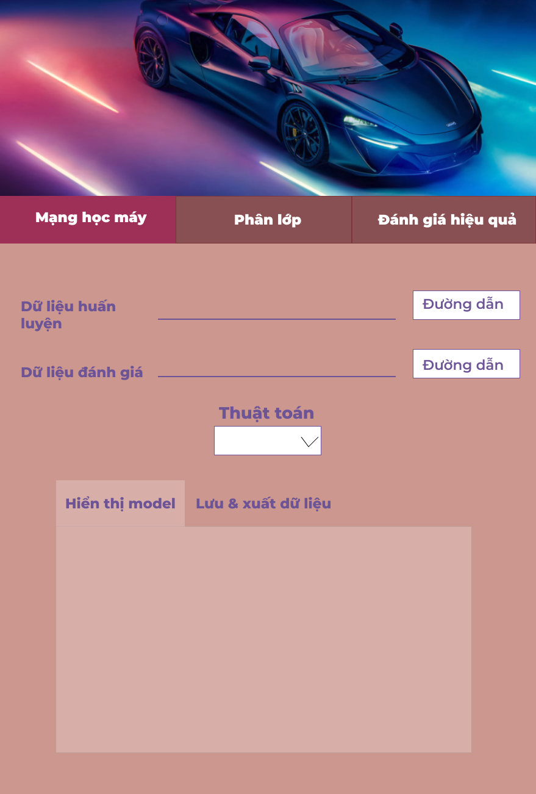
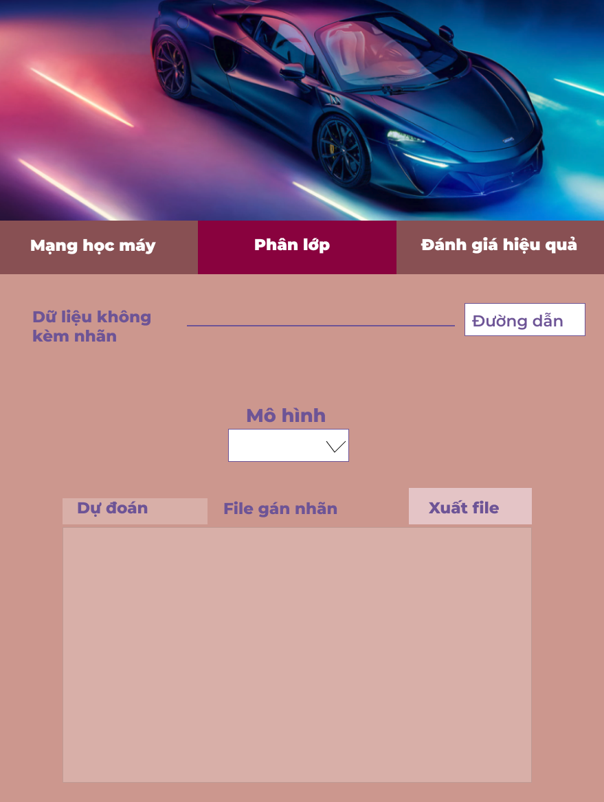
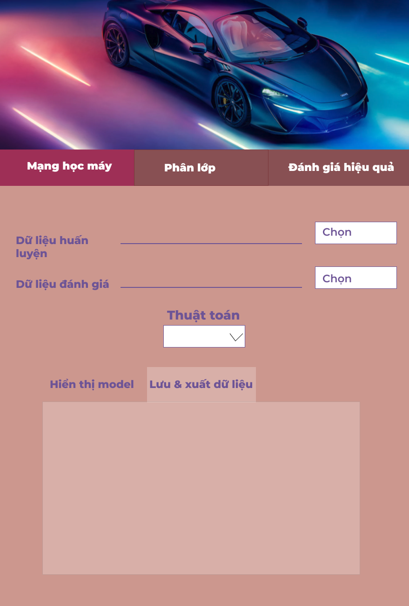
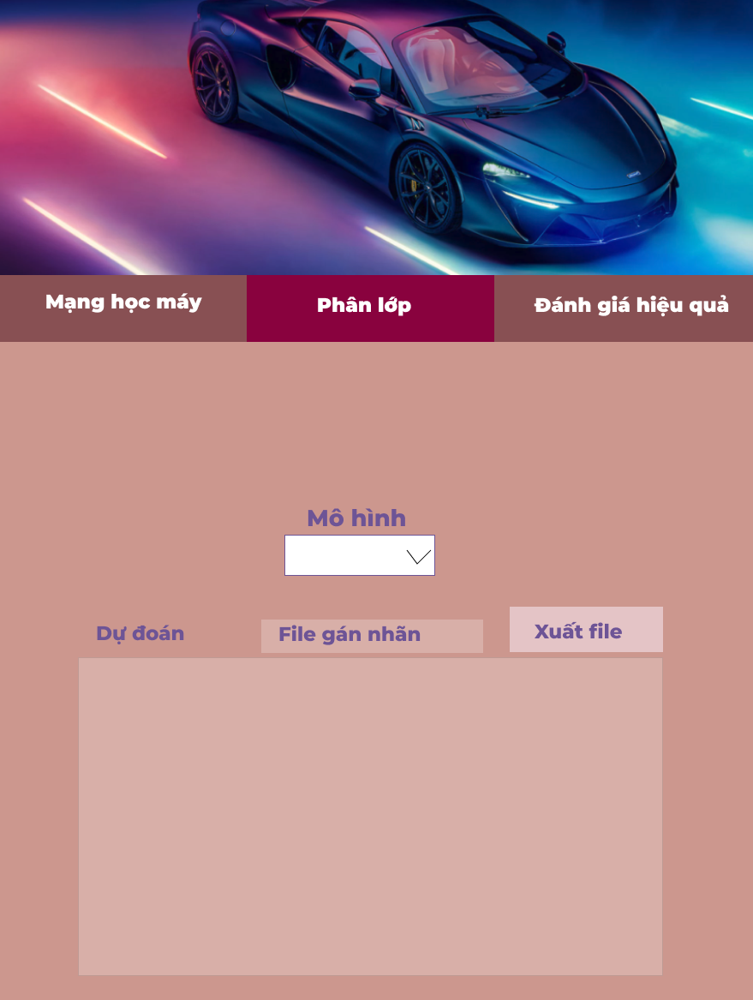
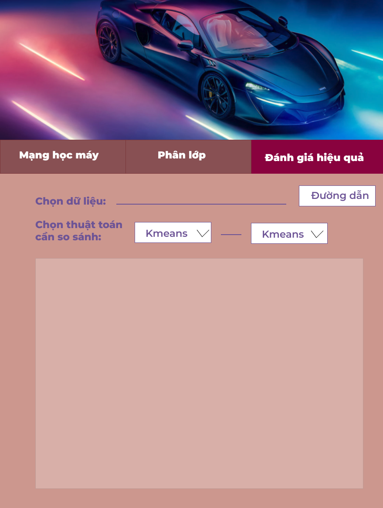

# Báo cáo khai phá dữ liệu Đa phương tiện

## I. Tóm tắt

### 1. Giới thiệu tổng quan

Khai phá dữ liệu là quá trình sàng lọc khối lượng lớn dữ liệu, phân tích dữ liệu từ các khía cạnh khác nhau và tổng hợp lại thành thông tin hữu ích. Một trong những ứng dụng máy tính được sử dụng rộng rãi trong việc khai thác dữ liệu là công cụ Weka - một chương trình giao diện người dùng với sự tổng hợp các thuật toán học máy được triển khai bằng Java và có mã nguồn mở. Và mặc dù được sử dụng rộng rãi để khai thác dữ liệu cũng như khả năng xử lý dữ liệu lớn mạnh mẽ. Tuy nhiên với một số nhu cầu/ yêu cầu cụ thể từng trường hợp. Việc xây dựng trang web hoặc phần mềm riêng biệt chức năng, giúp tối ưu hoá người dùng (giản lược một số chức năng nâng cao không cần thiết, giải quyết trực tiếp vấn đề đặt ra …)

### 2. Bài toán

Một số ứng dụng tiêu biểu trong khai phá dữ liệu là dự đoán, đánh giá và phân loại đối tượng. Trong báo cáo này nhóm hướng tới việc phân loại các dòng xe theo từng đặc tính của từng hãng. Nhằm đề ra những dòng xe tối ưu trong từng hoàn cảnh cụ thể

## II. Triển khai hệ thống

### 1. Kiến trúc tổng quan hệ thống

Luồng xử lý hệ thống được thể hiện như hình sau

**Kịch bản hoạt động**

| Chức năng | Chuỗi sự kiện chính |
| --- | --- |
| Mạng học máy | Tại màn hình chính người dùng chọn Tab “Mạng học máy”, ở đây người dùng sẽ tiến tới phân loại trên bộ dữ liệu gồm: “Dữ liệu huấn luyện, dữ liệu kiểm thử và dữ liệu không dán nhãn” |
| Phân lớp | Người dùng nhấn vào Tab “Phân lớp” ở giữa 2 tab “Mạng học máy” và “Đánh giá hiệu quả”. Ở đây dữ liệu đầu vào không cần có nhãn |
| Đánh giá hiệu quả (so sánh độ chính xác của các thuật toán) | Người dùng sau khi chọn Tab “Đánh giá hiệu quả” trên cùng góc bên phải giao hiện. Màn hình hiển thị 2 loại thuật toán (Đã được lưu Model & hiệu xuất tính toán) |
| Đọc ghi file dữ liệu và Model  | Ở các tab chính đều có phần đọc ghi dữ liệu file, ngoài ra nút ấn Xuất model giúp tiện theo dõi chỉ số hiệu quả  |

### 2. Xử lý Back-end theo quy trình KDD

1. **Tiền xử lý và tạo mô hình**
Thứ nhất các thông tin về các hãng xe cũng như dòng xe con của hãng đó được thu thập vào cơ sở dữ liệu. Mỗi bản ghi bao gồm thông số cấu hình xe (Chiều cao, độ rộng, số xăng tiêu thụ ….) Từ dữ liệu này các thông tin không liên quan được loại bỏ - Ở đây các cột như “Năng lượng tiêu thụ (Fuel Type)” & “Vị trí bộ dẫn động (Engine Location - đa phần là trước)” sẽ được nhóm loại bỏ khi đa số các xe có sự tương đồng về thông số các chỉ mục này
2. **Tiền xử lý dữ liệu** 
Ở đây khi nhóm làm việc với file dữ liệu về xe ban đầu ban đầu phát sinh lỗi trong bản ghi khiến cho phần mềm weka không đọc và xử lý được → Xoá cột số thứ tự đầu tiên (do bị tràn ký tự)
Ngoài ra bản ghi ban đầu chưa phân lớp mà là các bản ghi với các thuộc tính rời rạc → nhóm chọn Class cho bản ghi là tên thương hiệu xe

    
    
    
3. **Tạo bộ dữ liệu để làm việc**
Ở đây ta sử dụng WEKA GUI để chia dữ liệu ban đầu bằng bộ lọc Remove Percentage - 70% cho huấn luyện, 30% cho kiểm thử và 10 bản ghi không có nhãn không trong bộ dữ liệu Training và Test
4. **Kiếm chứng chéo (Fold cross validation)**
Trong thống kê, kiểm chứng chéo là việc phân nhóm một mẫu dữ liệu thành các mẫu con để cho việc phân tích ban đầu chỉ thực hiện trên một mẫu con đơn nhỏ, còn các mẫu con còn lại được giữ "kín" để dùng cho việc xác nhận và kiểm chứng lại lần phân tích đầu tiên đó.
Ta sẽ thực quy trình kiểm chứng chéo 10 lần, với mỗi lần phù hợp được thực hiện trên một tập huấn luyện bao gồm 90% tổng số tập huấn luyện được chọn ngẫu nhiên, với 10% còn lại được sử dụng như một tập hợp Thẩm định.

    
    
    
1. **Thể hiện trực quan hoá và đánh giá thuật toán** 
Trong bảng này, nhóm xác định thuật toán tối ưu là thuật toán có thông tin tỷ lệ chính xác cao thu được. Nếu hai hay nhiều mô hình có độ chính xác không cách biệt nhiều → tiến tới so sánh thời gian xử lý, độ phức tạp của thuật toán ….
    
    
    
6. **Mô hình Knowledge Flow**
    
    
    

### 3. Front end

- Công cụ thiết kế → App sử dụng Java Swing và IDE Netbean
- Phân tích thiết kế

| Tiêu đề | Nội dung |
| --- | --- |
| Tên Usecase | Nhập đường dẫn |
| Tác nhân | Người dùng |
| Mục tiêu | Nhập thành công đường dẫn có chứa file cho hệ thống xử lý (đọc ghi đúng định dạng) |
| Tiền điều kiện
 |  |
| Luồng hoạt động cơ
bản | 1. Giao diện trang chủ của ứng dụng mở ra 
2. Người dùng ấn vào tab “mạng học máy” hoặc “phân lớp”
2. Pop-up cửa sổ hiện lên để người dùng đưa, chọn file
4. File đúng định dạng, không trống  |
| Ngoại lệ | File lỗi, sai định dạng, người dùng phải nhập lại đường dẫn hoặc chọn lại file |

| Tiêu đề | Nội dung |
| --- | --- |
| Tên Usecase | Hiển thị Model |
| Tác nhân | Người dùng |
| Mục tiêu | Hiển thị thông số Model được train sau khi sử dụng một thuật toán bất kỳ |
| Tiền điều kiện
 | Sau khi chọn đường dẫn file và nhấn thuật toán cần sử dụng |
| Luồng hoạt động cơ
bản | 1. Giao diện trang chủ của ứng dụng mở ra 
2. Người dùng ấn vào tab “mạng học máy” hoặc “phân lớp”
2. Pop-up cửa sổ hiện lên để người dùng đưa, chọn file
4.  Người dùng chọn nút “Algorithm” để cửa sổ hiện ra các thuật toán
5. Sau khi người dùng chọn thuật toán → Máy tự động xử lý thuật toán đó |
| Ngoại lệ | Chưa kịp xử lý file model cũ → Không cập nhập kết quả mới |

| Tiêu đề | Nội dung |
| --- | --- |
| Tên Usecase | Lưu và xuất file Model |
| Tác nhân | Người dùng |
| Mục tiêu | Lưu lại thông tin chỉ sổ model để tiện đánh giá cũng như tái sử dụng  |
| Tiền điều kiện
 | Sau khi một thuật toán bất kỳ được train với dữ liệu |
| Luồng hoạt động cơ
bản | 1. Giao diện trang chủ của ứng dụng mở ra 
2. Người dùng ấn vào tab “mạng học máy” hoặc “phân lớp”
2. Pop-up cửa sổ hiện lên để người dùng đưa, chọn file
4. File đúng định dạng, không trống 
5. Chọn MultiSelect Button → tên thuật toán cần dùng
6. Chọn tab con “Lưu và xuất thuật toán” |
| Ngoại lệ | Sau khi được train |
- Luồng hoạt động từng chức năng
    
    
    
    Chọn file dẫn
    
    
    
    Chọn model xử lý file
    
    
    
    Lưu Model
    
    
    
     Đánh giá độ hiệu quả Model/ thuật toán
    

## III. Sản phẩm và kết quả

Kết quả được biểu diễn qua ảnh chụp màn hình dưới đây. 

Phân lớp dữ liệu

Mạng học máy

So sánh hiệu qủa thuật toán

### 1. Dataset

- Gốc
Tập dữ liệu về các dòng xe hơi kèm thông số của các dòng xe hơi, cũng như các phân khúc con của từng hãng xe đó 
Gồm 205 mẫu

Làm sạch (Sửa chữa các thông tin bản ghi bị trống: `?`) và giảm bớt dữ liệu dư thừa 

- Train Dataset (70% dữ liệu gốc)
- Test Dataset (30% còn lại dữ liệu gốc)
- Unlabel Dataset (10 phần tử bất kỳ chưa có trong tập dữ liệu Train và Test )

### 2. Model

Mô hình NaiveBays

Mô hình Cây quyết định

Mạng KNN

Mạng NN

Mạng SVM

### 3. Code và Video (File đính kèm)